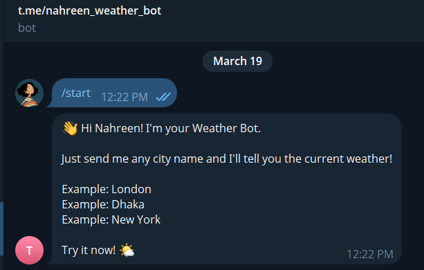
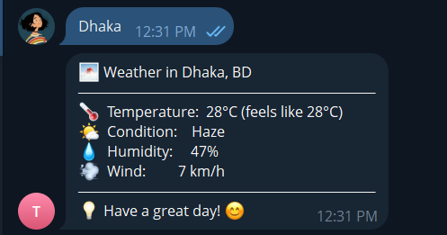
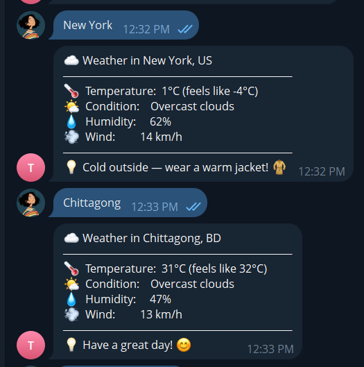

# Weather Bot 🌤

A Telegram bot that tells you the current weather for any city in the world.
Built with Python. Deployed free on Render. 100% free to run.

---

## How it looks when running

```
You:  London
Bot:  ☁️ Weather in London, GB
      ──────────────────────────────
      🌡  Temperature:  14°C (feels like 11°C)
      🌤  Condition:    Overcast clouds
      💧  Humidity:     78%
      💨  Wind:         19 km/h
      ──────────────────────────────
      💡 Have a great day! 😊
```

---

## Files explained (read this first!)

```
weather_bot/
├── bot.py           ← The main file. Handles Telegram messages.
├── weather.py       ← Fetches weather from OpenWeatherMap API.
├── requirements.txt ← List of Python packages to install.
├── .env.example     ← Template for your secret keys.
├── render.yaml      ← Tells Render.com how to run your bot.
└── README.md        ← This file!
```
## 📸 Screenshots

### 🟢 Example 1


### 🟢 Example 2


### 🟢 Example 3

